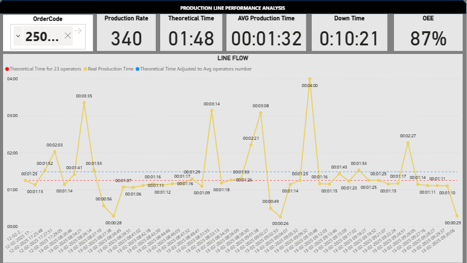
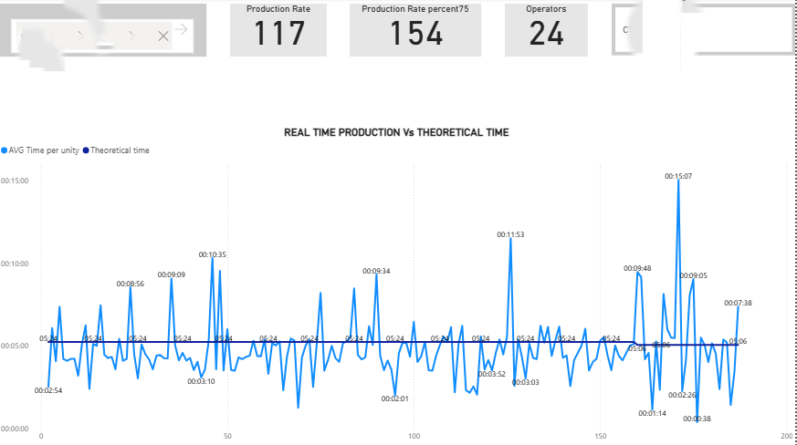
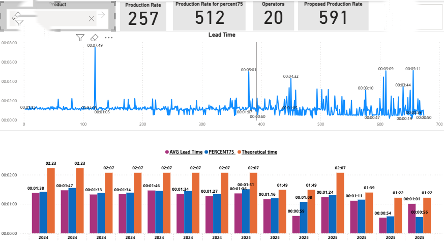

Production Line Performance & OEE Analysis

Industrial data analytics project focused on production efficiency, OEE, and downtime reduction.

---

Production Dashboard (OEE & KPIs)

---

Production Performance Analysis

Comparison between theoretical and actual production time to identify inefficiencies and performance deviations.

---

Cycle Time Analysis

Analysis of production cycle time variability and comparison with theoretical targets to detect anomalies and inefficiencies.

---

**Metrics**

- OEE (Overall Equipment Effectiveness)  
- Production Efficiency  
- Downtime (Non-Production Time)  
- Theoretical vs Actual Production Time  
- Cycle Time Analysis
  
**Tools & Technologies**

- Power BI  
- DAX  
- SQL  
- Python  
- Excel / CSV / Parquet  

**Business Impact**

This type of analysis helps organizations:

- Reduce downtime  
- Improve production efficiency  
- Identify bottlenecks  
- Optimize operational performance  
- Support data-driven decision making  
